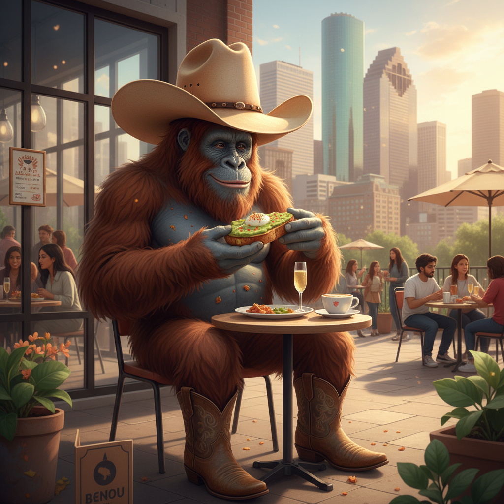

<!-- This repository contains a fun image asset combining Bigfoot, avocado toast, and Houston themes. -->

# bigfoot-avo-toast-houston-1772998794148

A creative image repository featuring a Bigfoot-themed avocado toast concept with a Houston twist.



## About

This repository hosts a novelty image asset — **bigfoot-avo-toast.png** — combining the iconic legend of Bigfoot, the beloved avocado toast, and the city of Houston into one unique piece of visual content.

## Project Structure

| File | Description |
|------|-------------|
| `README.md` | Project documentation |
| `bigfoot-avo-toast.png` | Main image asset featuring the Bigfoot avocado toast Houston concept |

## Usage

To use the image in your own project, you can clone the repository:

```bash
git clone https://github.com/farmrecipes67/bigfoot-avo-toast-houston-1772998794148.git
```

Or reference the image directly in markdown:

```markdown

```

## License

No license has been specified for this repository. Please contact the repository owner at [farmrecipes67](https://github.com/farmrecipes67) for usage permissions.

## Links

- **Repository:** [https://github.com/farmrecipes67/bigfoot-avo-toast-houston-1772998794148](https://github.com/farmrecipes67/bigfoot-avo-toast-houston-1772998794148)

---

<sub>This README was auto-generated. Last updated: 2026-03-08</sub>